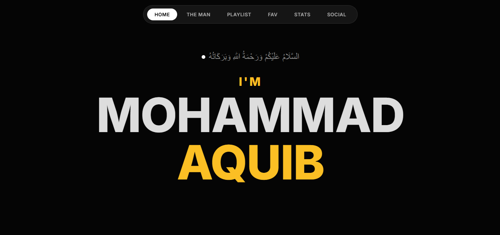

  <!-- Premium Header matching the website typography -->
  

  

 

> **A highly personalized, dark-themed web space designed to reflect my digital identity. It serves as a visual diary encompassing my technical journey, personal interests, current learnings, and creative showcases.**

## 📸 Digital Experience

  <!-- DHYAN DEIN: Is image ko dekhne ke liye apne repo me "1001023917.jpg" zaroor upload karein -->
  
  
<i>A glimpse into my personal digital space</i>

## 🌌 Inside My Space

This project is not just a standard portfolio; it's a curated experience of who I am. 
Here are the key segments featured on the platform:

* 🎵 **Current Playlist:** A dynamic showcase of my current musical vibe.
* ❤️ **My Favourites:** A curated list of my top interests and sweet preferences.
* 📊 **My Stats:** Colorful, radial visual data representing my core skills and current focus levels.
* 🧠 **My Learnings:** Documented insights and technical knowledge I am currently acquiring.
* 🎮 **Creative & Gaming Zone:** A dedicated section for my gaming highlights and digital assets.

## 💻 Tech & Design Stack

  
  
  
  

## ⚠️ Exclusive Rights & Usage Policy

**© 2026 Mohammad Aquib. All Rights Reserved.**

This repository is strictly a **Showcase-Only Portfolio**. 
The source code, UI/UX design, personal images, data, and overall architecture contained within this project are highly personal. **Cloning, copying, reproducing, scraping, or distributing this source code for personal, academic, or commercial use is strictly prohibited.** 

You are welcome to visit the live link to experience the design, but no part of this project may be reused or hosted under a different name.

<!-- 

  

 -->

 
 

<!-- Premium Gold Divider -->

  

 

<!-- Connect With Me Section -->

  <h2 style="color: #E8B62C;">Let's Connect 🤝</h2>
  
Feel free to reach out for collaborations, projects, or just a friendly chat!

  
  
  
  
  

 

<!-- Animated Thank You Message -->

  

<!-- Premium Waving Footer in Gold -->

  

